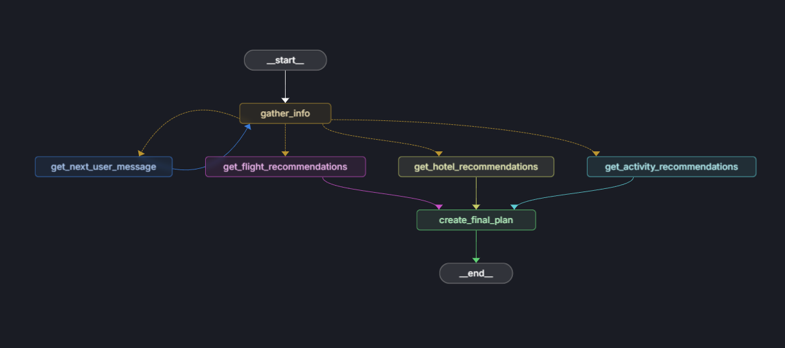

# ✈️ AI Travel Agent - Your Global Trip Planner 🌍

> **Plan trips to ANY destination worldwide with AI-powered agents using real flight, hotel, and weather APIs**

[](https://streamlit.io/)
[](https://python.org/)
[](https://ai.pydantic.dev/)
[](https://langchain-ai.github.io/langgraph/)



---

## 🌟 **Experience the Future of Travel Planning**

### 🌎 **Plan Trips Anywhere on Earth**
```
🗾 Tokyo, Japan     → Cherry blossom season, authentic ryokans, bullet trains
🗼 Paris, France    → Michelin dining, Seine cruises, Louvre tours
🏝️ Bali, Indonesia → Beach resorts, temple visits, volcano hikes
🏔️ Reykjavik, Iceland → Northern lights, geothermal spas, glacier tours
🕌 Marrakech, Morocco → Desert safaris, medina riads, Atlas mountains
🏛️ Athens, Greece   → Ancient ruins, island hopping, Mediterranean cuisine
```

### ⚡ **Real-Time Data Integration**
- 🌤️ **Live Weather** → Current conditions for 200,000+ cities worldwide
- ✈️ **Real Flights** → Actual prices, schedules, and availability
- 🏨 **Hotel Rates** → Live inventory, pricing, and guest reviews
- 🛡️ **Smart Backup** → Intelligent fallbacks ensure it always works

---

## 🤖 **Multi-Agent Intelligence System**

### 🧠 **How It Works**
```mermaid
graph TD
    A[👤 User: "I want to go to Tokyo"] --> B[🧠 Info Agent]
    B --> C{Complete Details?}
    C -->|No| D[❓ Ask Questions]
    C -->|Yes| E[⚡ Parallel Processing]
    E --> F[✈️ Flight Agent]
    E --> G[🏨 Hotel Agent]
    E --> H[🎯 Activity Agent]
    F --> I[📋 Final Planner]
    G --> I
    H --> I
    I --> J[📱 Complete Itinerary]
    D --> B
```

### 🎯 **Specialized AI Agents**

| Agent | Role | Data Source |
|-------|------|-------------|
| 🧠 **Info Gatherer** | Extracts travel details from conversation | Natural language processing |
| ✈️ **Flight Expert** | Finds optimal flights worldwide | AviationStack API |
| 🏨 **Hotel Specialist** | Discovers perfect accommodations | RapidAPI Hotels |
| 🎯 **Activity Curator** | Suggests weather-based activities | OpenWeatherMap API |
| 📋 **Trip Synthesizer** | Creates comprehensive itineraries | AI orchestration |

### ⚡ **Key Features**
- 🌍 **Global Coverage** → Any city, any country, anywhere on Earth
- 🔄 **Real-Time Sync** → Live data from multiple travel APIs
- 💬 **Natural Chat** → Just describe your dream trip in plain English
- 🎛️ **Smart Preferences** → Learns your airline, hotel, and budget preferences
- 🛡️ **Always Works** → Intelligent fallbacks ensure 100% uptime

---

## 🚀 **Quick Start Guide**

### 📋 **Prerequisites**
- Python 3.11+
- Any LLM API key (OpenAI, OpenRouter, Anthropic, or local Ollama)

### ⚡ **Installation**

```bash
# 1. Clone the repository
git clone <your-repo-url>
cd travel_agent

# 2. Create virtual environment
python -m venv venv

# Windows
venv\Scripts\activate

# macOS/Linux
source venv/bin/activate

# 3. Install dependencies
pip install -r requirements.txt
pip install aiohttp  # For API calls
```

### 🔑 **Configuration**

Create a `.env` file in the `travel_agent` directory:

```env
# LLM Configuration (Required)
PROVIDER=OpenRouter
BASE_URL=https://openrouter.ai/api/v1
LLM_API_KEY=your_api_key_here
MODEL_CHOICE=qwen/qwen3-14b:free

# Travel APIs (Optional - enables real data)
WEATHER_API_KEY=your_openweathermap_key
FLIGHT_API_KEY=your_aviationstack_key
HOTEL_API_KEY=your_rapidapi_key
```

### 🌐 **Get Free API Keys** (Optional but Recommended)

| Service | Free Tier | What You Get |
|---------|-----------|--------------|
| [OpenWeatherMap](https://openweathermap.org/api) | 1,000 calls/day | Real weather for 200,000+ cities |
| [AviationStack](https://aviationstack.com/) | 1,000 calls/month | Live flight data worldwide |
| [RapidAPI Hotels](https://rapidapi.com/apidojo/api/hotels4/) | Free tier available | Global hotel search & pricing |

> 💡 **Pro Tip**: The system works perfectly without API keys using smart mock data, but real APIs unlock live global travel information!

### 🎬 **Launch Your Travel Agent**

```bash
# Start the application
streamlit run streamlit_ui.py

# Test API integration (optional)
python test_apis.py
```

Open your browser to `http://localhost:8501` and start planning! 🎉

---

## 💬 **How to Use**

### 🌍 **Just Describe Your Dream Trip**

```
💬 "I want to go to Tokyo from New York, June 15-22, hotel budget $200/night"

💬 "Planning a romantic trip to Paris from LA, July 1-8, luxury hotels preferred"

💬 "Family vacation to Bali from Chicago, August 10-20, need pool and breakfast"

💬 "Adventure trip to Iceland from Miami, September 5-12, mid-range budget"

💬 "Business trip to Dubai from London, October 1-5, 5-star hotels only"
```

### 🎛️ **Customize Your Preferences**
- ✈️ **Airlines**: Choose your preferred carriers
- 🏨 **Amenities**: Must-have hotel features (pool, gym, spa, etc.)
- 💰 **Budget**: Budget, mid-range, or luxury travel style

---

## �️ **Technical Architecture**

### �️ **Built With**
- **[Pydantic AI](https://ai.pydantic.dev/)** → Type-safe agent framework
- **[LangGraph](https://langchain-ai.github.io/langgraph/)** → Multi-agent orchestration
- **[Streamlit](https://streamlit.io/)** → Interactive web interface
- **Real APIs** → Live travel data integration

### 📁 **Project Structure**
```
travel_agent/
├── agents/                    # AI agent definitions
│   ├── info_gathering_agent.py   # Extracts travel details
│   ├── flight_agent.py          # Flight search & recommendations
│   ├── hotel_agent.py           # Hotel search & booking
│   ├── activity_agent.py        # Weather-based activities
│   └── final_planner_agent.py   # Trip synthesis
├── agent_graph.py             # LangGraph workflow orchestration
├── streamlit_ui.py            # Web interface
├── utils.py                   # API integrations & utilities
├── test_apis.py              # API testing suite
└── .env                      # Your API keys (not tracked)
```

### 🔄 **Workflow**
1. **Info Gathering** → Extract destination, dates, budget from natural language
2. **Parallel Processing** → Simultaneously search flights, hotels, activities
3. **Data Integration** → Combine real API data with user preferences
4. **Trip Synthesis** → Generate comprehensive travel itinerary
5. **Real-time Streaming** → Display results as they're generated

---

## 🌟 **What Makes This Special**

### 🎯 **Real vs Mock Data**
- **With API Keys**: Live flight prices, current weather, real hotel availability
- **Without API Keys**: Intelligent mock data that still provides realistic planning
- **Always Works**: Graceful fallbacks ensure 100% uptime

### 🚀 **Advanced Features**
- **Parallel Processing** → Multiple agents work simultaneously for speed
- **Natural Language** → Just describe your trip in plain English
- **Global Coverage** → Any destination, any country, anywhere on Earth
- **Smart Preferences** → Remembers your travel style and preferences
- **Real-time Streaming** → Watch your trip plan build in real-time

### 🏗️ **Inspired by Anthropic's Architecture**
This project demonstrates the [parallel agent workflow](https://www.anthropic.com/engineering/building-effective-agents) pattern:


1. **Gather Info** → Extract travel requirements
2. **Fan Out** → Parallel agent processing
3. **Aggregate** → Synthesize comprehensive plan

---

## 🛡️ **Security & Privacy**

- 🔒 **API Keys Protected** → `.env` file never committed to Git
- 🛡️ **Local Processing** → Your travel data stays on your machine
- 🔐 **Secure APIs** → All external calls use HTTPS encryption

---

## 🤝 **Contributing**

Want to make this even better? Here's how:

- 🌍 **Add More APIs** → Integrate car rentals, tours, restaurants
- 🎨 **Enhance UI** → Improve the Streamlit interface
- 🤖 **New Agents** → Create specialized agents for specific travel types
- 🌐 **Localization** → Add support for multiple languages

---

## 📄 **License**

MIT License - Feel free to use this for your own travel planning adventures!

---

## 🙏 **Acknowledgments**

Built with amazing open-source tools:
- **[Pydantic AI](https://ai.pydantic.dev/)** → Type-safe AI framework
- **[LangGraph](https://langchain-ai.github.io/langgraph/)** → Multi-agent orchestration
- **[Streamlit](https://streamlit.io/)** → Beautiful web interfaces

---

**Ready to plan your next adventure? Let's go! ✈️🌍**
